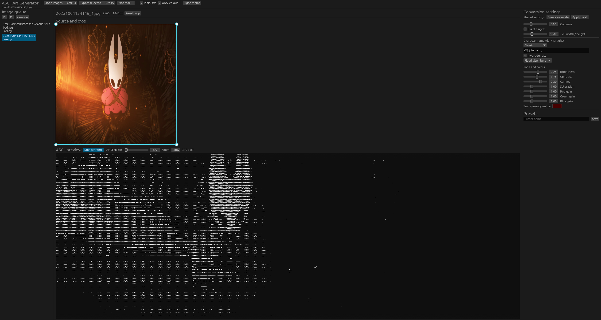

# ASCII Art Generator

ASCII Art Generator is a cross-platform Rust desktop editor that turns images into text you can save, share, paste into a terminal, or use wherever a picture is not an option. It exports portable monochrome `.txt` files and, when you want to keep the image's colour, 24-bit ANSI-colour `.ansi.txt` files.

## Why this project exists

Images do not always belong in an image file. Sometimes the nicest version of a picture is a terminal banner, a small piece of text art in a README, a creative message, or something that can travel in a plain-text file. Online converters are useful for a quick experiment, but they often make the important choices for you.

This project exists to make that process feel hands-on: you can crop the image, decide how much detail you want, choose the characters, tune the colour and contrast, see the result immediately, and export it locally.

## A quick example

The supplied example below shows the workflow in one window: the image and crop are at the upper left, conversion controls are on the right, and the generated ASCII preview is underneath.



In this example, the app reads the bright figure, the dark scene around it, and the warm orange light. It reduces that information into a grid of characters while keeping enough contrast for the subject to remain recognisable. Switching on ANSI colour keeps the sampled colours too, for terminals that support true colour.

## Run the program

### From source

This project uses Rust 1.92.0 or newer and includes a `rust-toolchain.toml` file to select the right toolchain automatically.

1. Install Rust with [rustup](https://rustup.rs/).
2. Open a terminal in this project folder.
3. Run:

```shell
cargo run --release
```

The first build downloads dependencies and can take a few minutes. After that, `cargo run --release` launches the editor. You can also run the built executable directly from `target/release/` (`ascii-art-generator.exe` on Windows).

### Platform notes

- **Windows:** building from source may require the Visual Studio C++ Build Tools with the Desktop development with C++ workload.
- **macOS:** install the Xcode Command Line Tools if Rust asks for a linker: `xcode-select --install`.
- **Linux:** install the native build and windowing dependencies. For Ubuntu or Debian:

```shell
sudo apt-get install build-essential pkg-config libdbus-1-dev libxkbcommon-dev libwayland-dev libx11-dev libxi-dev libgl1-mesa-dev
```

At runtime, Linux also needs an XDG Desktop Portal backend such as `xdg-desktop-portal-gtk` or `xdg-desktop-portal-kde`. `zenity` is used as a file-dialog fallback.

## How the conversion works

The program does not try to identify objects in the image. It works directly with the pixels, which keeps the result predictable and gives you control over the artistic choices.

1. It loads the image, applies supported EXIF rotation, and reads the red, green, blue, and transparency value for every pixel.
2. It uses your crop and divides that area into character-sized cells. Pixels covered by each cell are area-averaged, so a small output still represents the source cleanly.
3. Transparent pixels are blended against the matte colour you choose. RGB gains, saturation, brightness, contrast, and gamma are then applied in a consistent order.
4. It measures each cell's perceived brightness using the Rec.709 luminance formula. Dark cells select dense characters and light cells select sparse characters from the chosen ramp.
5. If ANSI colour is enabled, the character keeps the sampled RGB colour while its density still comes from brightness. The result is ordinary text plus terminal colour escape sequences.

For example, a ramp such as `@%#*+=-:. ` runs from dense to sparse. A shadow will usually use one of the dense characters, while a highlight will use a dot or space. **Invert density** swaps that relationship without changing the detected colour.

## Editor guide

Start by choosing **Open images** or by dropping image files onto the window. The image queue supports PNG, JPEG, GIF, WebP, BMP, and TIFF. EXIF orientation is respected, and animated GIF/WebP files use their first frame.

| Feature | What it does |
| --- | --- |
| **Image queue** | Holds one or more source images. Select an item to edit it, reorder or remove it, and export one image or the whole queue. |
| **Source and crop** | Drag the crop outline or its corner handles to choose the part of the image that becomes ASCII art. Crops always belong to that individual image. Use **Reset crop** to restore the full source. |
| **Output size** | Choose a column count and the editor calculates a matching row count using the character-cell ratio. Turn on **Exact height** when you need a specific number of rows. A safety limit prevents accidentally creating more than one million cells. |
| **Character ramp** | Pick Classic, Compact, or Detailed, or enter a custom dark-to-light ramp. Custom ramps accept 2 to 256 printable ASCII characters, so the exported plain text remains portable. |
| **Tone and colour** | Tune red, green, and blue gains, saturation, brightness, contrast, gamma, and the transparency matte. These controls change how the image is interpreted before characters are chosen. |
| **Dithering** | Choose none, Floyd-Steinberg, or 4x4 Bayer. Dithering adds controlled variation to character density, which can preserve the feeling of gradients without changing sampled ANSI colours. |
| **Preview** | Switch between monochrome and ANSI-colour previews, adjust zoom, copy the shown art, and use the dark/light editor theme that is easiest on your eyes. |
| **Shared settings and overrides** | Most settings are shared by the queue. Create a per-image override when one image needs different treatment, reset it to the shared values, or apply the current settings to every item. |
| **Presets** | Save a named group of conversion settings and apply it later. Presets do not contain source paths, crops, or export locations. |
| **Export** | Enable plain text, ANSI colour, or both in the toolbar. Use `Ctrl+S` to export the selected image, or choose **Export all** for batch output. |

Interactive edits are converted in the background, so the preview stays responsive. When a newer edit arrives, an older preview job is discarded rather than replacing your latest result.

## Exported files

- Plain `.txt` files contain printable ASCII characters and LF line endings.
- ANSI `.ansi.txt` files use true-colour foreground sequences in the form `ESC[38;2;R;G;Bm`, avoid unnecessary colour changes, and reset styling at every line boundary and at the end of the file.
- ANSI art needs a true-colour-capable terminal and a monospace font. A normal text editor will show its escape sequences instead of colours.
- Single-image export opens a save dialog. Batch export asks for a folder and uses names such as `photo_ascii.txt` and `photo_ascii.ansi.txt`.
- Exports are written through a temporary sibling file before replacement, so an interrupted conversion does not leave a partial output file behind.

## Future direction: a website widget

The next major direction is compatibility with websites as an embeddable widget. The goal is a small browser-facing version that a site can place beside an upload field or inside a creative tool: visitors could drop in an image, adjust a simple character ramp and size, preview the result in a responsive `<pre>` block, then copy or download the text.

The current app is a native desktop editor, so that widget is not implemented yet. Its independent conversion engine is a good foundation for a future WebAssembly adapter and a reusable web component or JavaScript package. That work would need browser-safe image loading, a web UI, and an embedding API before it can be used on websites.

Other possible future additions include animation export, editable project files, and richer colour-profile support.

## Development

```shell
cargo fmt --check
cargo clippy --all-targets --all-features -- -D warnings
cargo test --all-targets --all-features
cargo build --release
```

The conversion engine is available independently of the GUI through the `ascii_art_generator` library. Its public API includes `ConversionSettings`, `CropRect`, `CharacterRamp`, `DitherMode`, `RowSizing`, `AsciiCell`, `AsciiDocument`, `convert`, `render_plain`, and `render_ansi`.

GitHub Actions checks formatting, Clippy, and tests, then produces unsigned portable artifacts for Windows x86-64, Linux x86-64, macOS Apple Silicon, and macOS Intel. macOS artifacts are not signed or notarized.

## License

MIT
